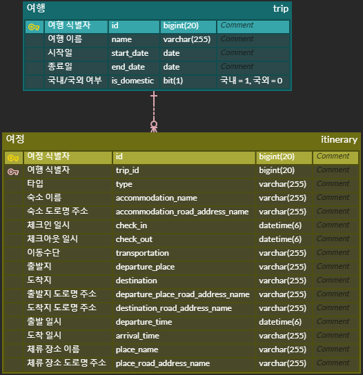

# 토이 프로젝트 2 : 여행 여정을 기록과 관리하는 SNS 서비스 2단계
2023-10-23 ~ 2023-10-27

---

## 📌 목차

- [멤버](#멤버)
- [설정](#설정)
- [설계](#설계)
- [API 문서](#API-문서)
- [개발 내용](#개발-내용)

---

## 멤버

- 👩🏻‍💻 [정의정](https://github.com/JeongUijeong)
- 👩🏻‍💻 [양유림](https://github.com/YurimYang)
- 👩🏻‍💻 [강민정](https://github.com/ypd06021)
- 👩🏻‍💻 [이의인](https://github.com/dldmldlsy)

---

## 설정

- 자바 버전: 17
- 스프링 버전: 6.0.13
- 스프링 부트 버전: 3.1.5 
- 의존성
    - spring-boot-starter-data-jpa
    - spring-boot-starter-validation
    - spring-boot-starter-web
    - mariadb-java-client
    - lombok:1.18.28
    - spring-restdocs-asciidoctor
    - spring-restdocs-mockmvc
    - spring-boot-starter-test
    - h2:2.2.220

---

## 설계

### DB 설계 (ERD)

> 

### API 설계

> | 기능       | Method | URI                          |
> |----------|--------|------------------------------|
> | 여행 등록    | POST   | api/trip                     |
> | 여정 기록    | POST   |                              |
> | 전체 여행 조회 | GET    | api/trip                     |
> | 특정 여행 조회 | GET    | api/trip/{trip_id}           |
> | 여행 수정    | PATCH  | api/trip                     |
> | 여행 삭제    | DELETE | api/trip/{trip_id}           |
> | 여정 조회    | GET    | api/itinerary/{trip_id}      |
> | 여정 수정    | PATCH  |                              |
> | 여정 삭제    | DELELTE | api/itinerary/{itinerary_id} |
※ 더 상세한 내용은 REST Docs를 통해 확인하실 수 있습니다.

---

## 개발 내용

- 여행 등록 기능
  - 여행 일정을 기록합니다.
- 특정 여행의 여정 등록 기능
  - 하나의 여행에 여러 개의 여정 정보를 기록할 수 있습니다.
- 여행 조회 기능 
  - 등록된 여행 전체 리스트를 조회할 수 있습니다.
  - 등록된 여행 리스트 중 여행 아이디를 URL PathVariable로 받아서, 해당 여행에 대한 정보와 여정 정보를 조회할 수 있습니다.
- 여행 정보 수정 기능
  - 여행 정보를 수정할 수 있습니다.
  - 여정 정보는 별도로 수정 기능을 제공합니다.
- 여정 정보 수정 기능
  - 여정 정보를 수정할 수 있습니다.
- 예외 처리
  - 여행 등록 시 실패하면 오류 메세지를 응답합니다.
  - 여행 조회, 수정 시 여행 정보가 없으면 오류 메세지를 응답합니다.
  - 시작일이 도착일 보다 늦는 등 일시 검증에 실패하면 오류 메세지를 응답합니다.

---